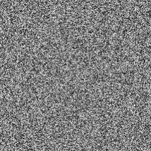

# MeshGenerator

For this project, I explored the algorithms and techniques for generating terrain meshes, from simple noise to erosion and image manipulation. Below, you can find a guide on how to navigate the interactable terrain generator UI, along with examples and explanations of the algorithms used to generate a mesh.

## Table of Contents
- [Installation](#installation)
- [Usage](#guide)
- [Features](#features)
    - [Generating a Mesh](#generation a mesh)
    - [Important Functions](#important functions)
    - [Noise Functions](#noise functions)
        - [Sampling](#sampling)
        - [Simple Noise](#simple noise)
        - [Perlin Noise](#perlin noise)
        - [Octave Noise](#octave noise)
        - [Image Maps](#image maps)
    - Simulations
    - Operations
- [Design](#design)

## Installation
- TODO create build and make installer
- TODO create WebGL build
- Maybe a docker container?

## Features
This section is dedicated to showing the algorithms used to generate terrain meshes. All of these algorithms are well known, so I will not being going too far in depth, but I will show the nuances that were needed to implement them for this project.

### Generating a Mesh

### Important Functions
#### Remapping
One of the most used functions in this demo is the Remap function. This function is very helpful when we have one range of values that we want to translate to another range of values. For example, given a value between 0 and 1, we can translate that value to another value in the range 0 to 100. Trivially, we can just multiply the value by 100. But what if we want the value to be in the range 0 to 105? We can use the value and it's relationship to it's range to get the new value.

The Remap function has the following signature:

    public static float Remap (float from, float fromMin, float fromMax, float toMin,  float toMax)

Here, *from* is our original value, *fromMin* is the original minimum value, *fromMax* is the original maximum value, *toMin* is the desired minimum value, and *toMax* is the desired maximum value. Formally, 

    from ∈ [fromMin, fromMax]

and we want to map *from* to the value *y*, such that
    
    from → y ∈ [toMin, toMax]

Intuitively, we can show the implementation as using the proportion of our initial range to find the the value.

### Noise Functions
The goal of noise functions is to generate sequences that have no repeating sections (at least as far as a human can tell). This is important for terrain generation because any repeating patterns become exceedingly obvious, especially when viewing from a distance. Further, we can use noise functions and image manipulation to initially generate realistic terrains before we apply more expensive erosion algorithms. Below are the noise functions implemented in the interactable demo.

#### Sampling
An important part of applying noise to our generated mesh is determining the range at which we want to sample our functions. Because we have a mesh of discrete vertices, we need to break up our sample range into equal parts. We can do this by simply remapping the coordinate of interest to the sample range. That is, we know the current dimensions of our mesh, what coordinate we're looking at, and the range we want to sample our function at.

|  |

| :--: |

| ABCDEFG |

#### Simple Noise
The simple noise algorithm is an implementation of the 2D noise function described by [Scratchapixel](https://www.scratchapixel.com/lessons/procedural-generation-virtual-worlds/procedural-patterns-noise-part-1/creating-simple-2D-noise). 

In essence, a 2D noise function generates a grid of random numbers called a lattice. The functions takes in an x and y coordinate to the grid. Any value outside the grid wraps back around. For example, for a 5x5 lattice, given the coordinate (5, 1) will return the value at position (0, 1), noting that (0, 0) is the origin of the grid. Intuitively, for a grid of any size, we are duplicate the grid to the left, right, up, and down to create a plane of values that we can sample from at any point. Though our implementation will only be take samples from x >= 0 and y >= 0, the function also allows for negative coordinates.

## Design
